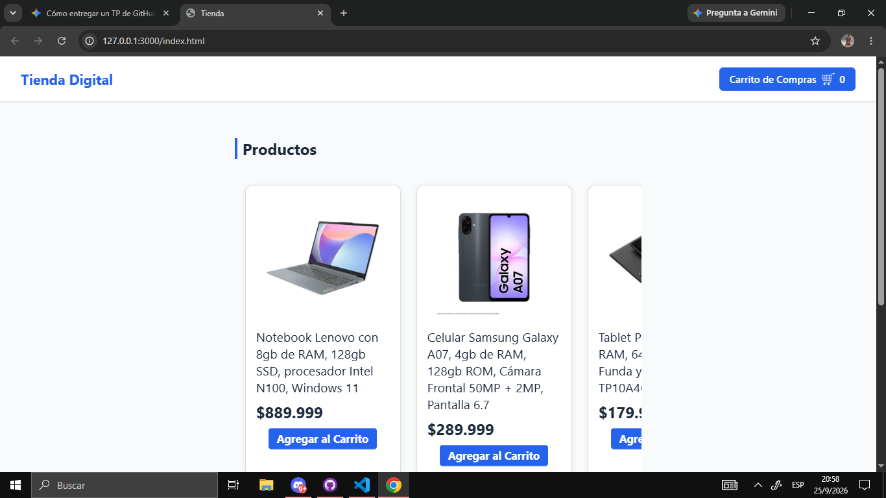
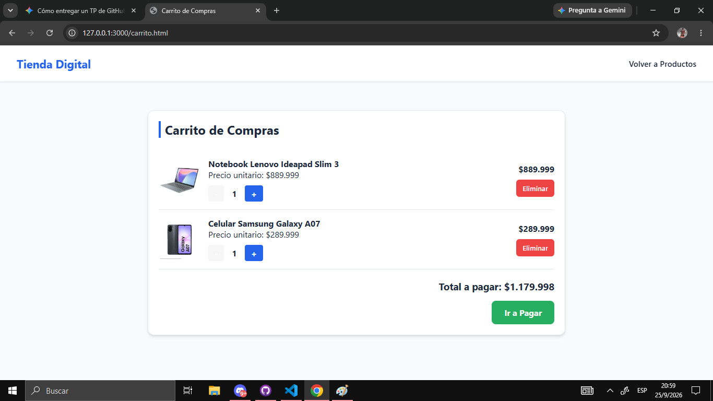
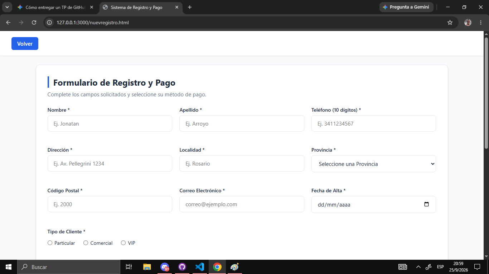
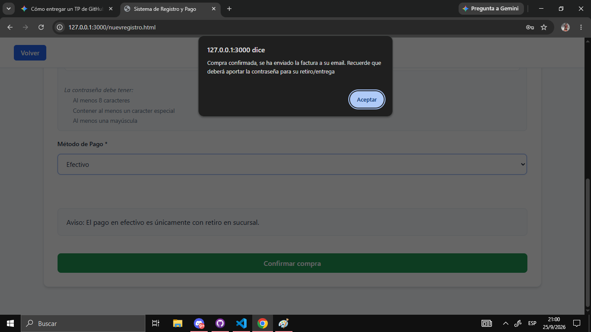

# 🛒 Tienda Digital - Trabajo Práctico de Programación

Sitio web de comercio electrónico (E-commerce) 
desarrollado como trabajo práctico, que simula el flujo completo de compra: 
visualización de productos, gestión de un carrito de compras, registro de usuarios y validación de pagos. Con información guardada en LocalStorage

---

## 🚀 Tecnologías utilizadas
* **HTML5** - Estructura semántica de las distintas vistas (`index`, `carrito`, `login`, `registro`, etc.).
* **CSS3** - Estilos personalizados y diseño visual de la tienda.
* **JavaScript (ES6+)** - Lógica de programación del lado del cliente (manipulación del DOM, gestión del carrito, control de formularios y almacenamiento local).

---

## 📂 Estructura del Proyecto
El proyecto está organizado de la siguiente manera:
* 📄 `index.html` - Página principal de la tienda (muestra el catálogo de productos).
* 📄 `carrito.html` - Vista del carrito de compras y gestión de ítems seleccionados.
* 📄 `iniciarSesion.html` - Formulario de acceso para usuarios registrados.
* 📄 `nuevoregistro.html` - Formulario de registro de nuevos clientes.
* 📄 `vistaProducto.html` - Detalle individual de cada producto.
* 📁 `assets/` - Recursos visuales e imágenes del proyecto.
* 📁 `js/` - Archivos lógicos separados por componentes (`carrito.js`, `inicio.js`, `nuevoregistro.js`, `producto.js`, `vistaProducto.js`).

---

## ✨ Funcionalidades Principales
* **Catálogo Dinámico:** Visualización de productos en la página principal con contador de artículos en el carrito.
* **Carrito de Compras:** Agregado de productos y control de cantidades.
* **Autenticación y Registro:** Páginas dedicadas para el ingreso (`iniciarSesion.html`) y alta de nuevos usuarios (`nuevoregistro.html`).
* **Checkout y Pago:** Validación de datos del cliente y métodos de pago para autorizar la transacción.

---

## 💻 Vista Previa

###  Página Principal y Catálogo

###  Carrito de Compras

###  Registro datos clientes  y método de pago

###  Validación  de datos y confirmación de compra

